# Regression  

####　问题引入
>宝可梦的ＣＰ（战斗能力）值

## 任务

我们根据已有的宝可梦进化前后的信息，来预测某只宝可梦进化后的CP值大小。我们拥有宝可梦进化前后的数据，input是进化前宝可梦（包括他的各种属性值），output是进化后宝可梦的CP值；因此我们使用的方法是Supervised Learning。
**Step1. 设计一个Model**
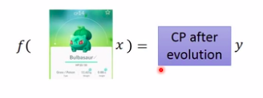
建立一些函数使其可以表示进化前后的关系，比如我可已设定这样一个函数：
$$y = b + w * x_{cp}$$
其中y是进化后该宝可梦的CP值，$x_{cp}$是进化前宝可梦的CP值，w and b are parameters。ｗ和b可以是任意值，那么就得到了无穷多的function。
$y = b + w * x_{cp}$是一种Linear model。
所谓的**Linear model**就是把一个function写成$y = b + \sum w_i*x_i$的形式，其中**b**是常量，**$w_i$**是各种参数，**$x_i$**是输入的各种属性，比如在这个例子中可以是宝可梦的CP值，身高、体重等变量。
**Step2.　Ｇoodness of Function**
我们已经设计了很多的function,可以使用现有的数据来测试设计好的functions,比如杰尼龟
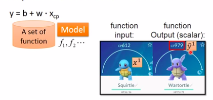
进化前的CP值为612，进化后为979。
$x^1$表示进化前的CP值  612
$\hat{y}^1$表示期望值  979
多次用Training data,如十组数据($x^1$, $\hat{y}^1$),($x^2$, $\hat{y}^2$),……($x^{10}$, $\hat{y}^{10}$)
如果我们把十只宝可梦的进化前后的CP值画到坐标系上：
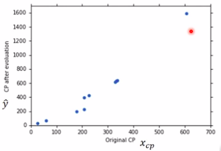
图中每一个小点都代表一组数据，有了这些数据我们就可以知道这些function的Loss。
Loss function L:
Input : a function, output: how bad it is
Loss function就是衡量某一个function的好坏程度，其实就是衡量$w$,$b$的好坏。
**如何定义Loss函数**
常见的做法如下：
$$L(w,b) = \sum_{i=1}^{n=10}(\hat{y}^n - (b + w * x_{cp}^n))^2$$
其中:

+ $x_{cp}^n$是第n组数据的CP值；
+ $(b + w * x_{cp}^n)$是根据所设计好的该函数的w值，b值所计算预测出的CP值;
+ $\hat{y}^n$是实际进化后的真实CP值；
+ $\hat{y}^n - (b + w * x_{cp}^n)$是预测误差
根据上述方程即可计算出该函数的Loss

比如上图中的红点代表当 w = -2, b = -180时，颜色越红函数越不好，越偏蓝色函数越好。就可以指出最好函数的大致方向。
**Step3: Best Function**
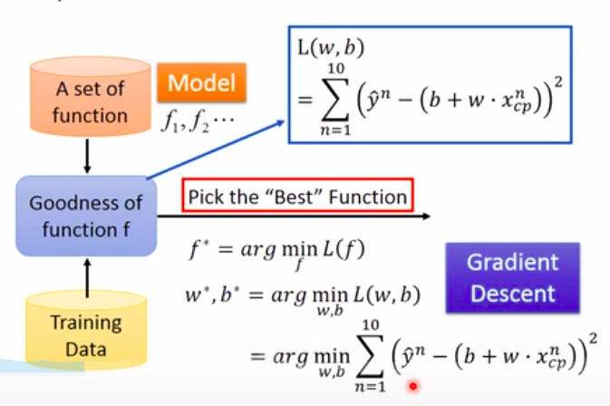
目前在第一步我们设置了很多的w和b，也就是定义了很多的函数，在第二部我们用现有数据检测这些函数那些是好的，那些是坏的，那么现在我们的目的是要找的一个最好的函数表达进化前后的关系，找到这个最好的函数，也就是找这个w和b,方法是。Gradient Descent(梯度下降)。

**如何找到一个最小的Loss值的function？**
举一个简单的例子，如果我们需要的函数只有一个w，那么我们可以穷举所有的w，计算出w对应的Loss值,看哪一个w可以使Loss值最小，但这样的方法太复杂。
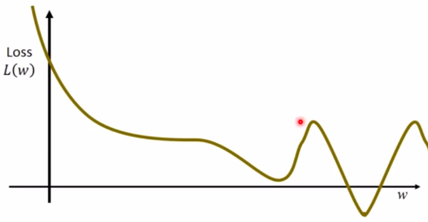
**Gradient Descent**怎么做呢？
我们先随机选取一个$w_0$,我们计算在Loss 在 w = $w_0$处的微分，如果微分是负的，说明Loss值正在下降，我们就应该增加w的值；如果是正的，说明Loss值在上升，就应该减少w的值。
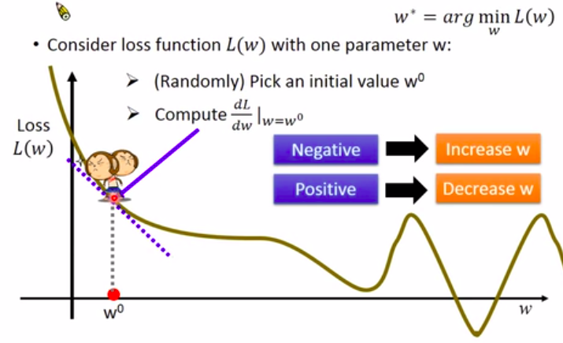
那么给w增大（减少）多少合适呢？
我们根据现在$w^0$点处的微分大小所决定:

上图中 $\eta$为**learning rate** 当微分小于0时，应增大w，故$\eta$前有符号。
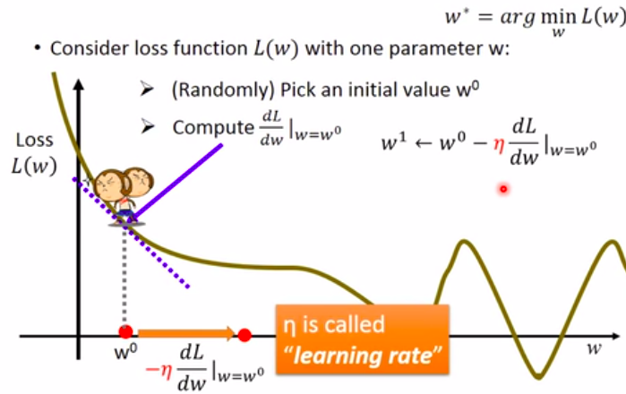
此时我们得到了$w^1$,重复上述步骤，我们回到一个Local Optimal的地方，但是在Linear Learning上是没有Local Optimal的,我们最终还是会找到Global Optimal。
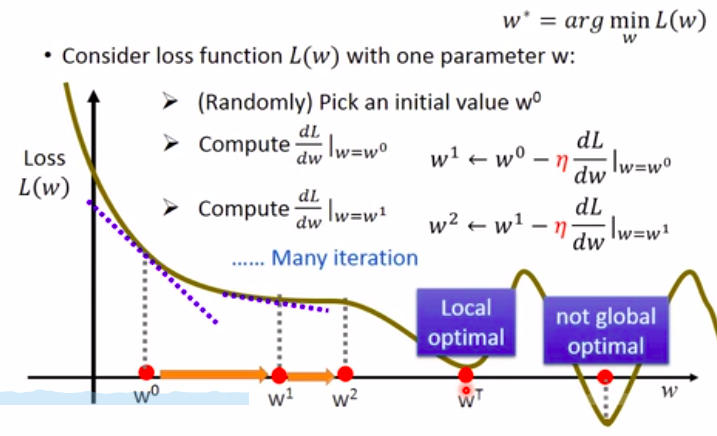
明白了上述一个参数的例子，我们回到刚开始的宝可梦的问题，有两个参数我们计算w和b的偏微分。在 **$w = w^0，b = b^0$** 时计算L对w, b的偏微分，并根据此偏微分和learning rate **$\eta$** 得到 **$w^1, b^1$** ，反复执行这个步骤得到最佳的w和b。
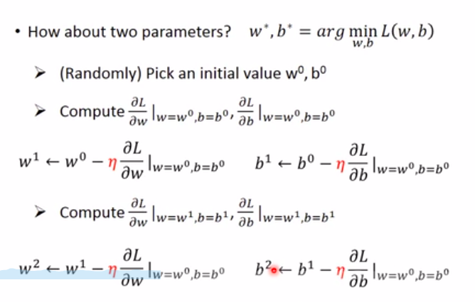
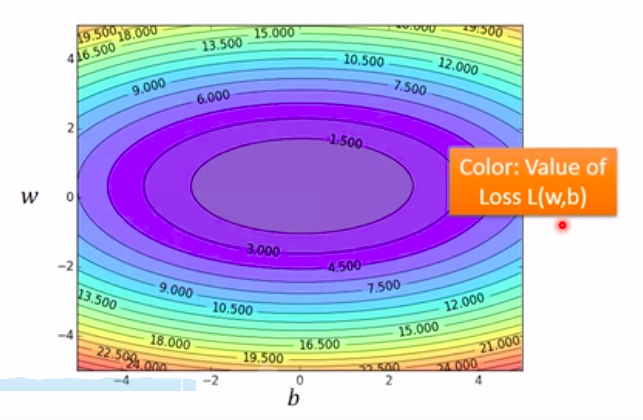
上图中，颜色越蓝，Loss越小。
随机选取一个点，根据上述步骤走，结果如下：
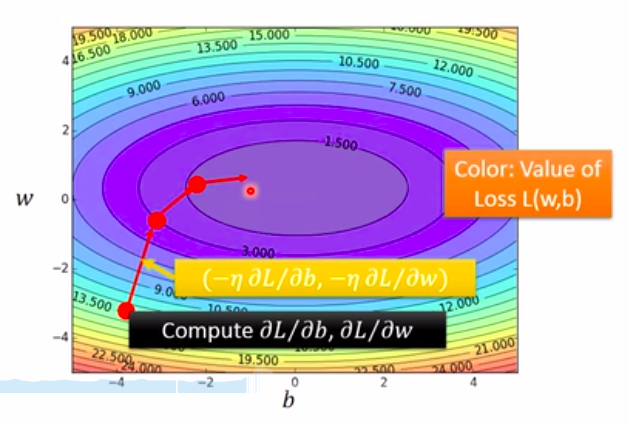
有一个令人担心的地方，如果Loss值如下图所示，会得到多个结果？
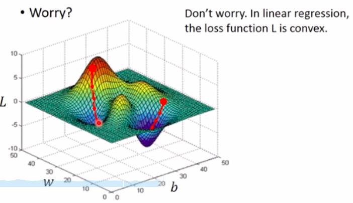
不需要担心，在Linear regression,没有Local Optimal，随便选一个点，根据Gradient descent 找到的参数是同一组参数。
最后补充一些偏微分的求导：
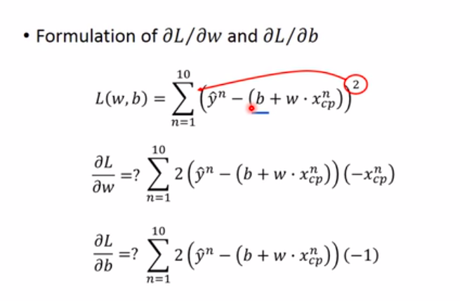

#### 结果是什么？
**Model : $$y = b + w * x_{cp}$$**

+ b = -188.4
+ w = 2.7
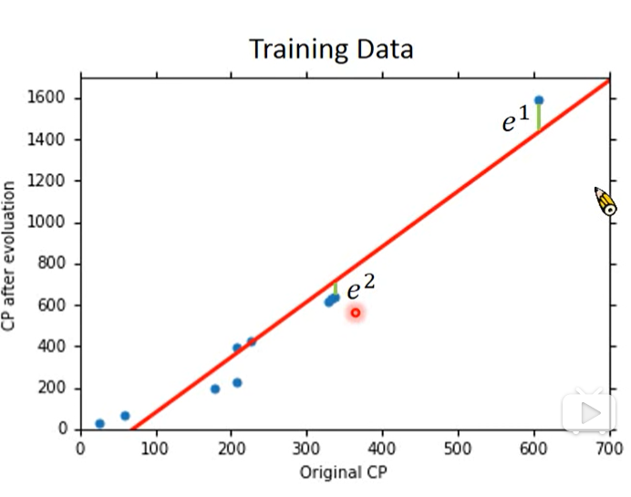

**Average Error on Training Data = 
$$\sum_{n=1}^{10}e^n = 31.9$$**
但是这个是training data 的error,并不是我们真正关心的error,我们应该拿test data 测试
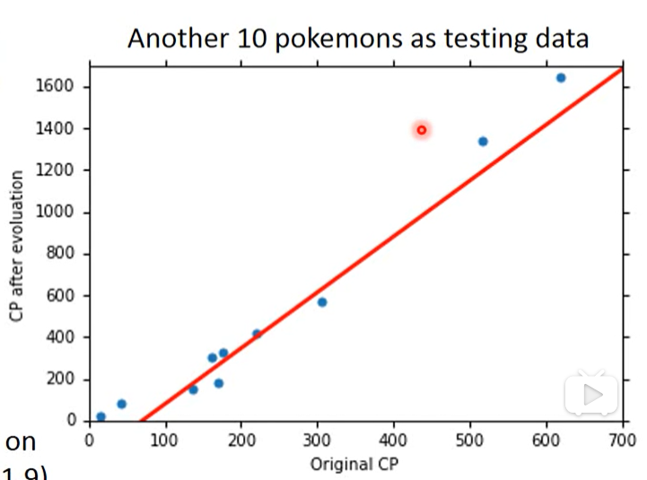
**Average Error on Testing Data =
$$\sum_{n = 1}^{10}e^n = 35.0$$\> Average Error on Training Data**
想要做的更改可以设计更好的Model。How can we do better?
#### Select Another Model:
##### 1. 举例来说我们可能需要引入二次式
##### $$y = b + w_1 * x_{cp} + w_2 * (x_{cp})^2 $$
得出的结果是

+ $b = -10.3$
+ $w_1 = 1.0, w_2 = 2.7 * 10 ^{-3}$

其函数图像如下：
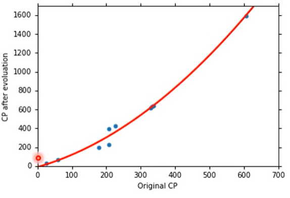
在Training data 上算的Average Error = 15.4
在Testing data 上算的Average Error = 18.4

##### 2. 引入三次式

##### $$y = b + w_1 * x_{cp} + w_2 * (x_{cp})^2 + w_3 * (x_{cp})^3$$

得出的结果是：

+ $b = 6.4, w_1 = 0.66$
+ $w_2 = 4.3 * 10^{-3}$
+ $w_3 = -1.8 * 10^{-6}$

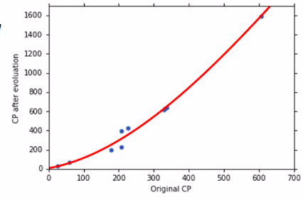

Training Data Average Error = 15.3
Testing Data Average Error = 18.1
根据这个趋势，有没有可能是4次方？

##### 3. 引入四次方

$$y = b + w_1 * x_{cp} + w_2 *(x_{cp})^2 + w_3 * (x_{cp})^3 + w_4 * (x_{cp})^4$$
函数图像如下：
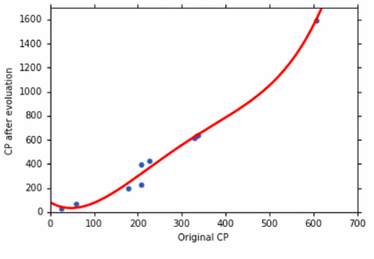

在Training Data Average Error = 14.9
在Testing Data Average Error  = 28.8
我们主要是为了测试Testing Data?换了一个更复杂的模型，反而Error比上一次的模型还要高？有没有可能是五次式？

##### 4. 引入五次式

$$y = b + w_1 * x_{cp} + w_2 *(x_{cp})^2 + w_3 * (x_{cp})^3 + w_4 * (x_{cp})^4 + w_5 * (x_{cp})^5$$

对应的函数图像如下:
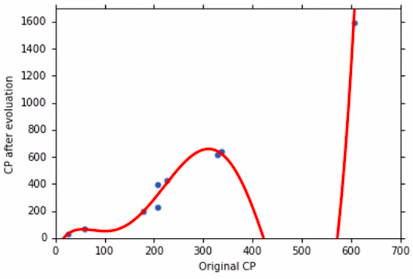
在Training Data Average Error = 12.8
在Testing Daa Average rror = 232.1
结果更糟糕

##### 总结五次Model

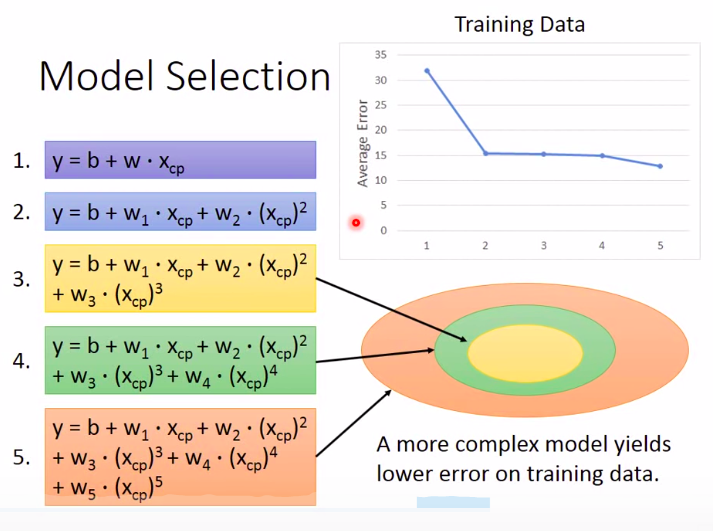
从上图可以明显看出次数越高，函数的范围越大 
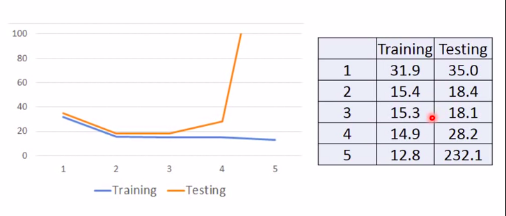
通过几次的model验算，可以看出在Training Data上，error越来越低，在Testing Data上，当超过某一次数时，error越来越高。A more complex model does not always lead to better performance on Testing Data.这种现象是Overfitting。

我们收集更多的数据
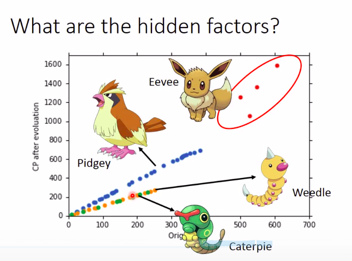
从上图发现进化前后的CP值与宝可梦的种族也有关系,我们据此重新设计函数。

#### Redesign The Model

$x_s$ = species  of x
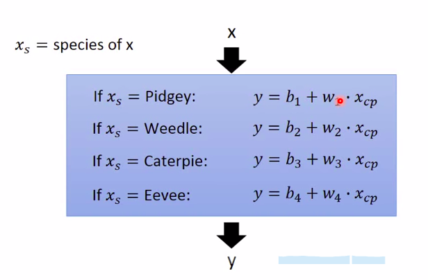
不同的物种代不同的function.
改写成Linear Model
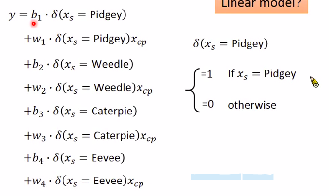
$b_1, b_2,...$
$w_1, w_2,...$这些还是我们这个function的参数，$\delta$就是一个feature。
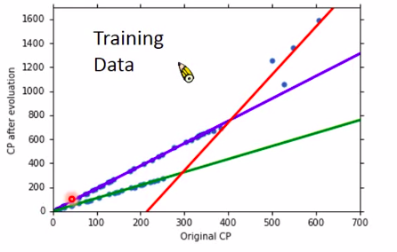
可以看到不同的种类就有不同的Linear Function。
在Training Data Average Error = 3.8
Testing Error = 14.3
比上一种Model error更小。
我们看到预测后的CP值还是不能仅仅贴合预测线，可能是有random number,也有可能是有别的factor,还能不能做的更好呢？
会不会进化后的CP值跟重量，高度、HP有关系？
我们不知道这些变量是否与进化后的CP值有关，我们可以把他们都塞到函数里，重新设计Model.

#### Redesign Model 

##### 1. Step1:

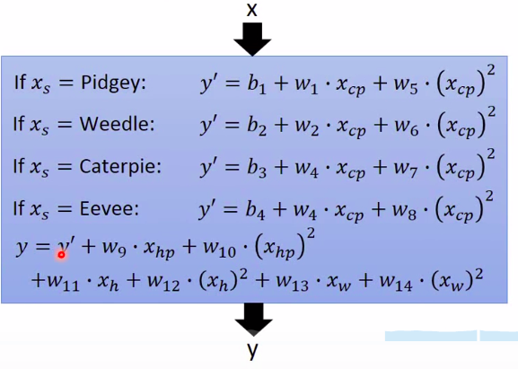
Training Data Average Error = 1.9
Testing Data Average Error = 102.3

Overfitting!!

##### 2. Step 2 : Regularization
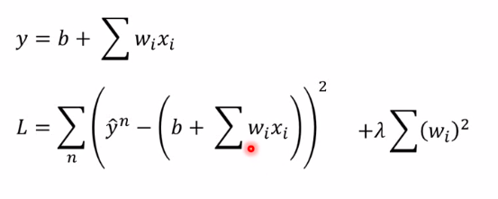
在原先的Loss function上加上 $\lambda \sum (w_i)^2$ 
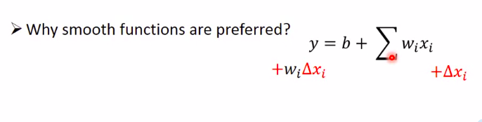
当参数$w_i$小的时候，接近于0，它的输入对输出的影响也就最小。
在这个Model上，如果输入改变值为$\Delta x_i$,那么输出改变值为$w_i * \Delta x_i$
所以我们$w_i$越小，这个函数相对应的就越平滑.
If some noises corrupt input x_i when testing A smoother function has less influence.
加入$\lambda$之后
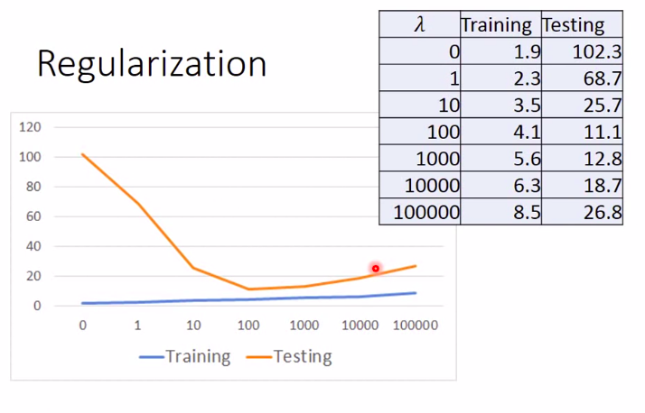
现在我们就不仅仅要考虑error， 也要考虑smoother, $\lambda$越大，代表考虑smoother影响的那一项越大,我们找到的function越平滑。

+ 在Training Data 上，$\lambda$越大，error越大？因为$\lambda$越大，我们越倾向于考虑w原来的值，减少考虑error。
+ 在Testing Data,error先减少，再增加。
我们喜欢比较平滑的function，$\lambda$，performance越好。但是我们又不喜欢太平滑的function,太平滑的function就是一条直线，在Testing Data上得不到想要的结果.
现在的问题是我们的Model多平滑呢？我们需要调整$\lambda$。
比如在上图中100左右有转折点，我们就选这个值左右的值为$\lambda$.
最后在Testing Data上的error为11.1.

### Conclusion  

宝可梦进化前后的CP值是有关系的，但是还有可能有其他的factors。
