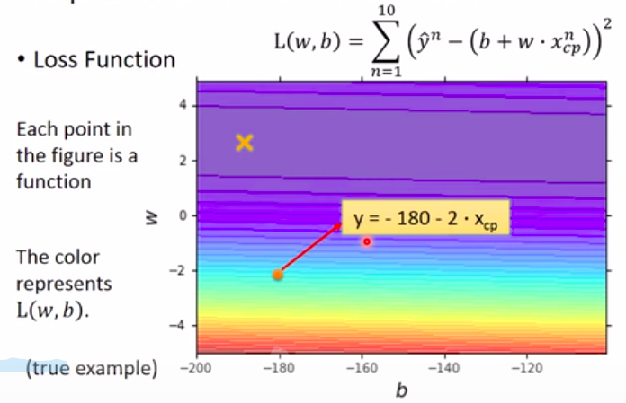

# Regression  

####　问题引入
>宝可梦的ＣＰ（战斗能力）值

## 任务

我们根据已有的宝可梦进化前后的信息，来预测某只宝可梦进化后的CP值大小。我们拥有宝可梦进化前后的数据，input是进化前宝可梦（包括他的各种属性值），output是进化后宝可梦的CP值；因此我们使用的方法是Supervised Learning。
**Step1. 设计一个Model**

建立一些函数使其可以表示进化前后的关系，比如我可已设定这样一个函数：
$$y = b + w * x_{cp}$$
其中y是进化后该宝可梦的CP值，$x_{cp}$是进化前宝可梦的CP值，w and b are parameters。ｗ和b可以是任意值，那么就得到了无穷多的function。
$y = b + w * x_{cp}$是一种Linear model。
所谓的**Linear model**就是把一个function写成$y = b + \sum w_i*x_i$的形式，其中**b**是常量，**$w_i$**是各种参数，**$x_i$**是输入的各种属性，比如在这个例子中可以是宝可梦的CP值，身高、体重等变量。
**Step2.　Ｇoodness of Function**
我们已经设计了很多的function,可以使用现有的数据来测试设计好的functions,比如杰尼龟

进化前的CP值为612，进化后为979。
$x^1$表示进化前的CP值  612
$\hat{y}^1$表示期望值  979
多次用Training data,如十组数据($x^1$, $\hat{y}^1$),($x^2$, $\hat{y}^2$),……($x^{10}$, $\hat{y}^{10}$)
如果我们把十只宝可梦的进化前后的CP值画到坐标系上：

图中每一个小点都代表一组数据，有了这些数据我们就可以知道这些function的Loss。
Loss function L:
Input : a function, output: how bad it is
Loss function就是衡量某一个function的好坏程度，其实就是衡量$w$,$b$的好坏。
**如何定义Loss函数**
常见的做法如下：
$$L(w,b) = \sum_{i=1}^{n=10}(\hat{y}^n - (b + w * x_{cp}^n))^2$$
其中:

+ $x_{cp}^n$是第n组数据的CP值；
+ $(b + w * x_{cp}^n)$是根据所设计好的该函数的w值，b值所计算预测出的CP值;
+ $\hat{y}^n$是实际进化后的真实CP值；
+ $\hat{y}^n - (b + w * x_{cp}^n)$是预测误差
根据上述方程即可计算出该函数的Loss

比如上图中的红点代表当 w = -2, b = -180时，颜色越红函数越不好，越偏蓝色函数越好。就可以指出最好函数的大致方向。
**Step3: Best Function**

目前在第一步我们设置了很多的w和b，也就是定义了很多的函数，在第二部我们用现有数据检测这些函数那些是好的，那些是坏的，那么现在我们的目的是要找的一个最好的函数表达进化前后的关系，找到这个最好的函数，也就是找这个w和b,方法是。Gradient Descent(梯度下降)。

**如何找到一个最小的Loss值的function？**
举一个简单的例子，如果我们需要的函数只有一个w，那么我们可以穷举所有的w，计算出w对应的Loss值,看哪一个w可以使Loss值最小，但这样的方法太复杂。

**Gradient Descent**怎么做呢？
我们先随机选取一个$w_0$,我们计算在Loss 在 w = $w_0$处的微分，如果微分是负的，说明Loss值正在下降，我们就应该增加w的值；如果是正的，说明Loss值在上升，就应该减少w的值。

那么给w增大（减少）多少合适呢？
我们根据现在$w^0$点处的微分大小所决定:

上图中 $\eta$为**learning rate** 当微分小于0时，应增大w，故$\eta$前有符号。

此时我们得到了$w^1$,重复上述步骤，我们回到一个Local Optimal的地方，但是在Linear Learning上是没有Local Optimal的,我们最终还是会找到Global Optimal。

明白了上述一个参数的例子，我们回到刚开始的宝可梦的问题，有两个参数我们计算w和b的偏微分。在 **$w = w^0，b = b^0$** 时计算L对w, b的偏微分，并根据此偏微分和learning rate **$\eta$** 得到 **$w^1, b^1$** ，反复执行这个步骤得到最佳的w和b。

上图中，颜色越蓝，Loss越小。
随机选取一个点，根据上述步骤走，结果如下：

有一个令人担心的地方，如果Loss值如下图所示，会得到多个结果？

不需要担心，在Linear regression,没有Local Optimal，随便选一个点，根据Gradient descent 找到的参数是同一组参数。
最后补充一些偏微分的求导：
