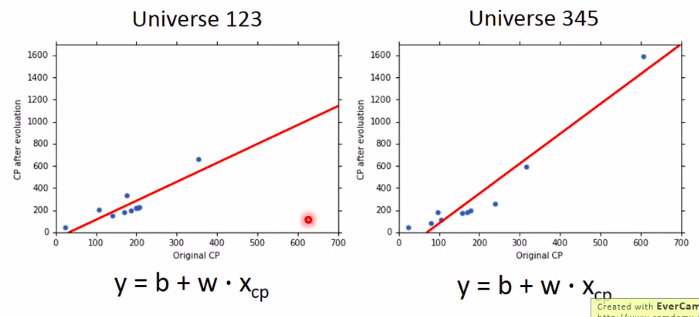

# Review  

A more complex model does not always lead to better performance on testing data.

**error** 来源是什么？

+ error due to "bias"(偏差)
+ error due to "variance"（方差）

可以诊断error来源，可以调整function.

Estimator (估算)

$\hat y $是真实的CP关系函数，我们求到的是$y^*$,只是我们的估计函数。
$f^*$ is an estimator of $\hat y$.

如上图我们找到的$f^*$就像打靶一样，在一定的范围内寻找最好的函数，$f^*$和$\hat f$之间的偏差来自于Bias + Variance。

#### Bias and variance of Estimator

##### example

+ Estimate the mean of a variable x（估计变量x的均值）
   1. assume the mean of x is $\mu $(假设x的均值为$\mu$)
   2. assume the variance of x is $\sigma^2$（假设x的方差是$\sigma^2）

+ Estimator of mean $\mu$
   1. Sample N points:{$x^1, x^2, ……，x^N$}
   $$m = \frac{1}{N}\sum _n x^n \neq \mu $$

当总共的x个数不一样时，并不能得到他的方差就一定是$\mu$,但是$$E[m] = E[\frac{1}{N}\sum _n x^n] = \frac{1}{N}\sum _n E[x^n] = \mu$$
就像打靶一样，会散布在$\mu$的周围，散布程度取决于$$Var[m] = \frac{\sigma^2}{N}$$
**Variance depends on the number of samples.**

$$s^2 = \frac{1}{N}\sum _n(x^n - m)^2$$

$s^2$会散布在$\sigma^2$的周围。他不是正好等于$\sigma^2$,
而是$$E[s^2] = \frac{N}{N -1}\sigma^2 $$,所以普遍而言$s^2$比$\sigma$小
!
观察上图，做了很多次试验，得到了很多的$f^*$,散布在$\hat f$周围，bias主要是因为一开始没有，估算的Estimator和靶心中心有距离，bias是因为瞄的时候就没有瞄准，variance是由于子弹射出去后造成的各种偏差，bias很大，variance很小。
但是为什么会有这么多的$f^*$呢?
举个例子，平行宇宙中，In different universes, we use the same model, but obtain different $f^*$.

其实就是每次抓不同的10只宝可梦.
$f^*$ in 100 Universes.
用同一个Model也不会有同样的函数，如下：

由上可得一个简单的model，我们得到的函数是比较集中的，Model越复杂，函数越分散。至于简单的Model为什么集中，是因为他们的variance比较小,就好像说每次射击的时候，射击的较近。
**Simpler model is less infilenced by the sampled data**

接下来再看bias
**Bias :If we average all the $f^*, is it close to \hat f$**
就像上图所示，bias小，我们找到的所有$f^*$都聚集在$\hat f$的周围某处,如果是大的bias，他们都散布在靶心周围，但是不管他们散的有多宽，他们的平均值和靶心是接近的。

但是没有办法算出平均的$\hat f$,我们假设一条函数图形作为众多$f^*$的平均值

所以简单的Model，有比较大的bias,复杂的Model，有比较小的bias。

简单的Model，bias比较大，variance比较小，复杂的Model，bias比较小，variance比较大。
上图曲线中，bias造成的error越来越小，瞄的越来越准，但是variance越来越大，误差越来越大。所以可以找一个平衡点。但是复杂Model的variance增长比较快，error就比较大了。
如果error来自variance很大，这个状况叫做Overfitting,如果来自bias很大，这个叫做Underfitting。

#### 如何知道现在的model是bias大还是variance大呢？

+ If your model cannot even fit the training examples,then you have large bias.
   
   如果你的Model只能满足少数几个Training Data,那么就是bias带来的error较大（Underfitting)
+ If you can fit the training data, but large error on testing data, then you probably have large variance(Overfitting)

#### 遇到不同的情况应该如何处理？

+ For bias, redesign your model:
   1. Add more features as input.
   2. A more complex model
+ For variance:
   1. More data,用更多的数据(Very effective, but nit always paractical)
   
   2. Regularization
   
   强制曲线平滑，但是这样会损害bias,还是得取平衡点。

#### Model Selection

+ There is usually a trade-off between bias and variance.
+ Select a model that blances two kinds of error to minimize total error
+ What you should not do:
    
    当选出一个较好的Model--Model3，但是Testing set是衡量Model的Set, 真正的Testing Set没有测试，新进来的Data没有看过，现在手上的Training Set有bias,拿选好的Model去测试真正的Testing Set测试，很可能不是最好的Model。
    
    把TRaining Data拆分为TRaining Data 和Validation Data(交叉验证)
    
    Using the results of public testing data to tune your model.
    You are making public set better than private set.
    如果说分Training Data，觉得还有bias，可以分很多份。
    
