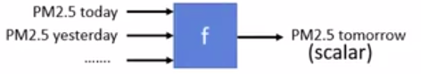

###机器学习
###一、机器学习就是自动找函数
####examples:
#####1. Speech Recognition(语音识别):
就是找到或者设计一个函数，输入一个语音变量，然后输出识别结果。

#####2. Image Recognition(图像识别):
就是定义一个函数，输入一张图片，作为变量，然后输出这张图片中的识别效果。

#####3. PlayingGo(阿尔法狗):
输入现在棋盘上的黑子白子的摆放位置为变量，输出下一步该摆放位置的坐标。

#####4. Dialogue System(对话系统):
找出一个函数，输入我说的话作为变量，函数返回一个返回语句作为响应。

###二、如何进行机器学习？

####1. 你想找什么函数？
想找的函数不同，就有不同的机器学习的任务。
**比如**:

+ 你想做一个预测明天PM2.5的项目，你要做的就是找一个函数，输入前几天的PM2.5值和天气变量，温度等等变量，输出明天PM2.5的值。像这样输出结果为**数值**的就叫做Regression。（The output of the function is a scalar）

+ 你想输入一个句子判断对错，输出Yes or No。这个任务就是Binary Classification。

+ 对事物进行分类，让机器做选择题。首先定义类别个数N，然后输入变量得到所属类别，这种的就叫做Multi-class Classification。输入一张图片，机器选择最合适的类别输出。

#####PS:机器学习不仅有Regression和Classification,这两个只是很小的一部分。
更复杂的是Generation(生成)，产生有结构的复杂东西(例如：文句、图片)。

####2. 已经想好找什么函数，怎样告诉机器想找什么样的函数？

#####2.1 Supervised Learning 监督学习
假设你心里已经想好找什么样的函数，比如输入一张图片，然后输出类别：

现在我们要输入一张猫的图片，然后输出这张图片内容的类别“Cat”。
如何做呢？我们需要先给机器大量的图片，还要告诉机器如果把这些图片输入到我们心里想的那个函数，他的正确输出是什么。对数据做标记。这样的方式就是Supervised Learninig。
接下来机器就可以评估一个函数的好坏，找出函数的Loss。机器根据编写的函数测试刚才准备的大量资料，计算Loss值。如下图Loss值为50%:

如果一个函数的Loss值越小，那么他就越接近我们心里的那个函数。
接下来就是让机器自动找出Loss值最低的函数。

#####2.2 Reinforcement Learning(强化学习)
*Supervised **VS** Reinforcement*
对于阿尔法狗的例子来说，如果是Supervised,那么我们就要准备很多的数据：目前棋盘上黑子白字的个数及位置，然后下一步正确的位置是什么？

如果是Reinforcement Learning,让机器和机器自己下，或者是让机器和别人下，如果这盘赢了，说明这盘某些步下对了，但没有人告诉它是哪些地方下的不错；如果输了，机器要想办法自己成功率。

#####2.3 Unsupervised Learning 无监督学习
就给机器大量的数据，如大量的图片，机器可以学到什么？

####3. 机器怎样找出你想要的函数？

#####3.1 给定函数寻找范围
**Network Architecture**就是给机器定义一个搜寻范围，让机器在这个范围内寻找最合适的方法。（RNN / CNN）

函数寻找方法：**Gradient Descent** 
